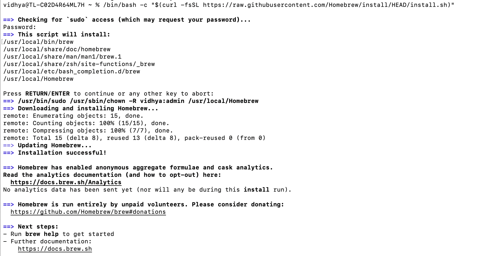

# Resources for Students: GitHub, Linux Access, and Python Dev Setup

This guide is designed to help students—especially those new to programming—quickly get up to speed with essential development tools and environments. It includes beginner-friendly resources for learning GitHub, accessing Linux from any operating system, and setting up a solid Python development environment. Whether you're starting your first project or just need a reference, this document aims to make your SIMCODES internship journey smoother and easy.

---

## 📚 Contents

1. [GitHub Resources for Beginners](#1-github-resources-for-beginners)
2. [Accessing Linux from Different Operating Systems](#2-accessing-linux-from-different-operating-systems)
3. [Setting Up a Python Development Environment](#3-setting-up-a-python-development-environment)

---

## 1. GitHub Resources for Beginners

Using Git and GitHub allows you to manage your code versions, collaborate with others, and back up your projects in the cloud.

### Step 1: Set Up Git

```bash
git config --global user.name "Your Name"
git config --global user.email your.email@example.com
```

### Step 2: Create a New Local Repository

```bash
mkdir my_project
cd my_project
git init
```

### Step 3: Add and Commit Files

```bash
echo "# My Project" > README.md
git add README.md
git commit -m "Initial commit"
```

### Step 4: Connect to a Remote Repository

First, create a repository on GitHub. Then:

```bash
git remote add origin https://github.com/your-username/your-repo.git
git branch -M main
git push -u origin main
```

### Step 5: Essential Git Commands

```bash
git status           # Check status
git log              # View commit history
git add .            # Add all changes
git commit -m "msg"  # Commit changes
git pull             # Pull changes from GitHub
git push             # Push local changes
```

### 🔗 Useful GitHub Resources

- [GitHub Docs - Getting Started](https://docs.github.com/en/get-started)
- [Git Handbook by GitHub](https://guides.github.com/introduction/git-handbook/)
- [GitHub Learning Lab](https://lab.github.com/)
- [Git Cheat Sheet (PDF)](https://education.github.com/git-cheat-sheet-education.pdf)

---

## 2. Accessing Linux from Different Operating Systems

### a. Windows (WSL - Windows Subsystem for Linux)

1. Open PowerShell as Administrator:
   ```bash
   wsl --install
   ```
2. Restart your computer when prompted
3. Choose a Linux distribution (e.g., Ubuntu)
4. Open Ubuntu from the Start Menu
5. Install packages:
   ```bash
   sudo apt update
   sudo apt install python3 python3-pip
   ```

### b. macOS

1. Open Terminal (`Cmd + Space` → type "Terminal")
2. Install Homebrew:
   ```bash
   /bin/bash -c "$(curl -fsSL https://raw.githubusercontent.com/Homebrew/install/HEAD/install.sh)"
   ```
3. Install Python and Git:
   ```bash
   brew install python git
   ```
4. Try a command:
   ```bash
   echo "Hello from the terminal!"
   ```

## This is how your terminal will look like if you are using the Mac



### c. Linux

1. Open Terminal (`Ctrl + Alt + T`)
2. Update and install Python:
   ```bash
   sudo apt update
   sudo apt install python3 python3-pip
   ```
3. Try a command:
   ```bash
   echo "Welcome to Linux!"
   ```

---

## 3. Setting Up a Python Development Environment

### a. Install Python

- Download: [https://www.python.org/downloads/](https://www.python.org/downloads/)
- During install: ✅ "Add Python to PATH"
- Verify:
  ```bash
  python --version
  ```

### b. Create and Activate a Virtual Environment

```bash
python -m venv myenv
```

- On macOS/Linux:
  ```bash
  source myenv/bin/activate
  ```
- On Windows:
  ```bash
  myenv\Scripts\activate
  ```

### c. Install Python Packages

```bash
pip install numpy pandas matplotlib
```

### d. Setting Up VS Code

1. Download: [https://code.visualstudio.com/](https://code.visualstudio.com/)
2. Install Python extension (by Microsoft)
3. Open your project folder
4. Open a `.py` file and VS Code will detect the environment

Optional: Install the Jupyter extension to run notebooks inside VS Code.

### e. Prettify Your Code (Optional)

- **Black (Formatter):**
  ```bash
  pip install black
  black my_script.py
  ```

- **Flake8 (Linter):**
  ```bash
  pip install flake8
  flake8 my_script.py
  ```

---

Happy coding and welcome to SIMCODES! 🚀
